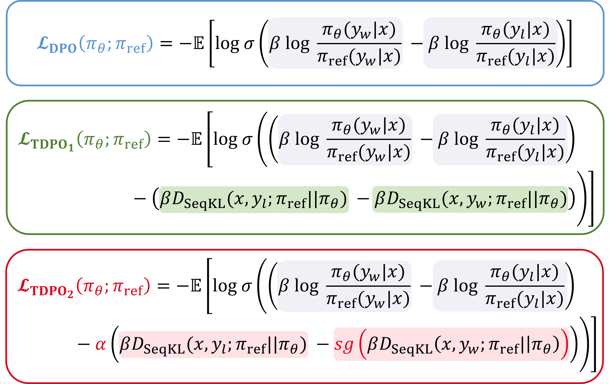

# TDPO: Token-level Direct Preference Optimization

This repo contains a reference implementation of the TDPO algorithm for training language models from preference data, as described in the paper [_Token-level Direct Preference Optimization_](https://arxiv.org/pdf/2404.11999.pdf) (ICML 2024). Our implementation is based on [DPO](https://github.com/eric-mitchell/direct-preference-optimization), and follows the same usage guidelines.

    

The TDPO pipeline has two stages:

1. Run supervised fine-tuning (SFT) on the dataset(s) of interest. Generally, $(x, y_w)$ from the preference dataset is directly used as the supervised fine-tuning target.
2. Run preference learning on the model from step 1, using preference data (ideally from the same distribution as the SFT examples). The dataset is generally composed of $\mathcal{D} = \{(x, y_w, y_l)_i\}_{i=1}^N$, where $x$ represents the prompt, $y_w$ and $y_l$ denote the preferred and dispreferred completion.

During training, we generally train for **one episode** in the **SFT** stage, while in the **RL Fine-tuning** stage, we run **multiple episodes** (e.g., three episodes) to enhance the performance of our algorithm.

The files in this repo are:

- `train.py`: the main entry point for training (either SFT or TDPO preference-based training)
- `trainers.py`: the trainer classes (e.g., implementing the loop of learning as well as multi-GPU logic)
- `utils.py`: some convenience functions used by multiple other files
- `preference_datasets.py`: dataset processing logic for both SFT and TDPO preference-based training; **this is where you'll need to make some additions to train on your own data**

The code here supports any causal HuggingFace model- look at our examples in `config/model` to add your own. Adding your own datasets is also easy. See [the README section](https://github.com/huggingface/peft) on adding datasets.

## Example

Let's work through a complete example training pythia 2.8B model on the Anthropic-HH dataset.

### Step 1: Set up environment

    python3 -m venv env
    source env/bin/activate
    pip install -r requirements.txt

### Step 2: Run SFT

    python -u train.py model=pythia28 datasets=[hh] loss=sft exp_name=anthropic_tdpo_pythia28 gradient_accumulation_steps=2 batch_size=64 eval_batch_size=32 trainer=FSDPTrainer sample_during_eval=false model.fsdp_policy_mp=bfloat16

### Step 3: Run TDPO

For running **TDPO2**, we recommend the following command:

    python -u train.py model=pythia28 datasets=[hh] loss=tdpo loss.alpha=0.5 loss.beta=0.1 exp_name=anthropic_tdpo_pythia28 gradient_accumulation_steps=2 batch_size=64 eval_batch_size=32 trainer=FSDPTrainer sample_during_eval=false model.fsdp_policy_mp=bfloat16 model.archive=/path/to/archive/from/sft/LATEST/policy.pt

To run **TDPO1**, we only need to pass the additional parameter `loss.if_tdpo2=false`:

~~~
python -u train.py model=pythia28 datasets=[hh] loss=tdpo loss.beta=0.1 loss.if_tdpo2=false exp_name=anthropic_tdpo_pythia28 gradient_accumulation_steps=2 batch_size=64 eval_batch_size=32 trainer=FSDPTrainer sample_during_eval=false model.fsdp_policy_mp=bfloat16 model.archive=/path/to/archive/from/sft/LATEST/policy.pt
~~~

When the learning rate/**lr** is low, we recommend the **TDPO1** algorithm; conversely,  for higher learning rates, the **TDPO2** algorithm is preferable.

We have included the training curve from wandb [here](https://wandb.ai/492277267/tdpo_demos). Additionally, we have also provided the comparison results with **DPO** on the IDMb experiment, as shown below.

![The experiment on IMDb dataset. (a) represents the frontier of expected reward and KL divergence with respect to the reference model. We implemented DPO, $\mathrm{TDPO}_1$, and different versions of $\mathrm{TDPO}_2$ with respect to the parameter $\alpha$. Both $\mathrm{TDPO}_1$ and $\mathrm{TDPO}_2$ outperform DPO in terms of the frontier, with $\mathrm{TDPO}_2$ showing further improvement over $\mathrm{TDPO}_1$. This demonstrates the effectiveness of our analysis and modifications. (b) and (c) present the progression of sequential KL divergence on the preferred and dispreferred responses subset over training steps respectively. (d) illustrates the difference between the sequential KL divergence on the dispreferred responses subset and that on the preferred responses subset throughout the training process, namely $margin=|D_{\mathrm{SeqKL}}({x}, {y}_w;\pi_{\mathrm{ref}}\|\pi_{\theta}) - D_{\mathrm{SeqKL}}({x}, {y}_l;\pi_{\mathrm{ref}}\|\pi_{\theta})|$. $\mathrm{TDPO}_2$ exhibit superior regulation over KL divergence compared to the $\mathrm{TDPO}_1$ and DPO algorithm.](figs/IMDb_experiment.png)

For more experimental details and information, please refer to our paper.

## Acknowledgements

Many thanks to the contributors of [DPO](https://github.com/eric-mitchell/direct-preference-optimization) for their valuable contributions to the RLHF community. For more detailed information, please refer to the  [DPO](https://github.com/eric-mitchell/direct-preference-optimization).

## Citing TDPO

If TDPO or this repository is useful in your research, you can use the following BibTeX entry to cite our paper:

~~~
@article{zeng2024token,
  title={Token-level Direct Preference Optimization},
  author={Zeng, Yongcheng and Liu, Guoqing and Ma, Weiyu and Yang, Ning and Zhang, Haifeng and Wang, Jun},
  journal={arXiv preprint arXiv:2404.11999},
  year={2024}
}
~~~

